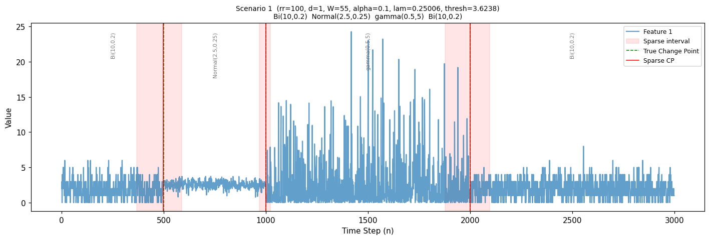
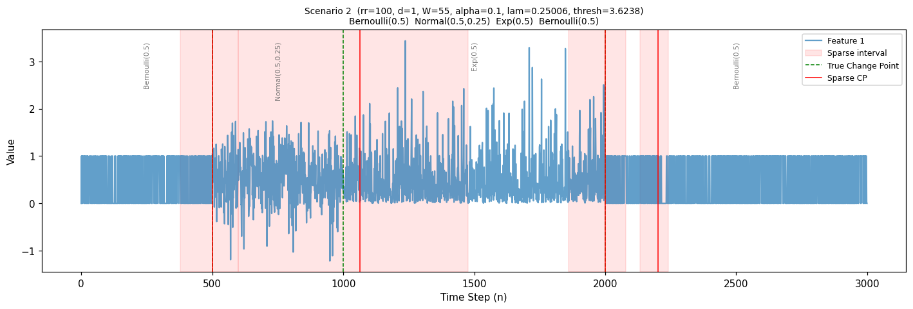

# rffmmd

Python package implementing sparse-grid change point detection with a whitened maximum mean discrepancy (MMD) statistic computed in Random Fourier Feature (RFF) space. It detects an unknown number of changes in the distribution of a univariate or multivariate series, including changes in shape where the mean and variance stay fixed.

The detector works in three stages:

- **Feature map and whitening.** Each observation is mapped into Random Fourier Features, and the features are rescaled by the inverse square root of their regularized covariance so that every direction has unit variance.
- **Greedy dyadic search.** Windows of width W, 2W, 4W, … are scanned, narrowest first. The first window whose two halves differ by more than the threshold is recorded, and the search recurses on either side of it.
- **Localisation.** Within each detected window, the split that maximises the weighted MMD is reported as the change point.

The detection threshold at significance level α is

$$T = \sqrt{2L} + \frac{\max\left(0,\; R\log\log\frac{n}{W} - \log\Gamma\left(\frac{R}{2}\right)\right) + \log\dfrac{1}{\log\frac{1}{1-\alpha}}}{\sqrt{2L}}, \qquad L = \log\frac{n}{W}$$

where n is the series length, W the smallest window width, and R the number of random features.

## Installation

```bash
pip install git+https://github.com/rpetch/RFF-Change-Inference.git
```

Requires Python 3.9+ and NumPy. The demo and example notebook also use matplotlib.

## Usage

```python
import numpy as np
from rffmmd import detect_sparse

rng = np.random.default_rng(0)
X = np.concatenate([rng.normal(0, 1, 1000),
                    rng.normal(3, 1, 1000),
                    rng.normal(3, 4, 1000)])[:, None]

result = detect_sparse(X, rr=5, alpha=0.10)
print(result["cps"])        # detected change points
print(result["thresh"])     # threshold used
```

| Argument | Meaning |
|---|---|
| `rr` | Number of random features. Also sets R in the threshold. |
| `alpha` | Significance level, between 0 and 1. |
| `aa` | Exponent setting the smallest window, W = n^aa. |
| `WW` | Smallest window width, set directly instead of through `aa`. |
| `lam` | Covariance regularization. Defaults to 1 / log(n / W). |
| `gamma` | Kernel bandwidth. Defaults to the median heuristic. |

To reproduce the benchmark plots:

```bash
python demo.py
```

## Results

Both benchmark scenarios with n = 3000 and true change points at 500, 1000 and 2000. Green dashed lines are the true change points, red solid lines the detections, and the shaded regions the detected windows before localisation.

**Scenario 1** — segments differ in mean and variance.



**Scenario 2** — mean and variance fixed; only the shape of the distribution changes.



## Repository structure

```
rffmmd/       The package
  core.py       Feature map, whitening, threshold, window grid, search, localisation, detector
  simulate.py   Synthetic benchmark scenarios with known change points
examples/     Notebook walking through each step of the method
figures/      Benchmark plots shown in this README
demo.py       Runs both benchmark scenarios and plots the results
test.py       Test suite
```

### Examples (`examples/`)

| File | Contents |
|---|---|
| `RFF_MMD_notebook.ipynb` | Section-by-section walkthrough of the method, from the feature map to the plotted detections on both benchmark scenarios |

### Benchmark scenarios

The synthetic data follows the design of Arlot, Celisse & Harchaoui (2019), Section 6.1.

- **Scenario 1** — segments differ in mean and variance.
- **Scenario 2** — every segment has mean 0.5 and variance 0.25; only the shape of the distribution changes.

## Testing

```bash
pip install -e ".[dev]"
pytest
```

## License

MIT — see [LICENSE](LICENSE).
